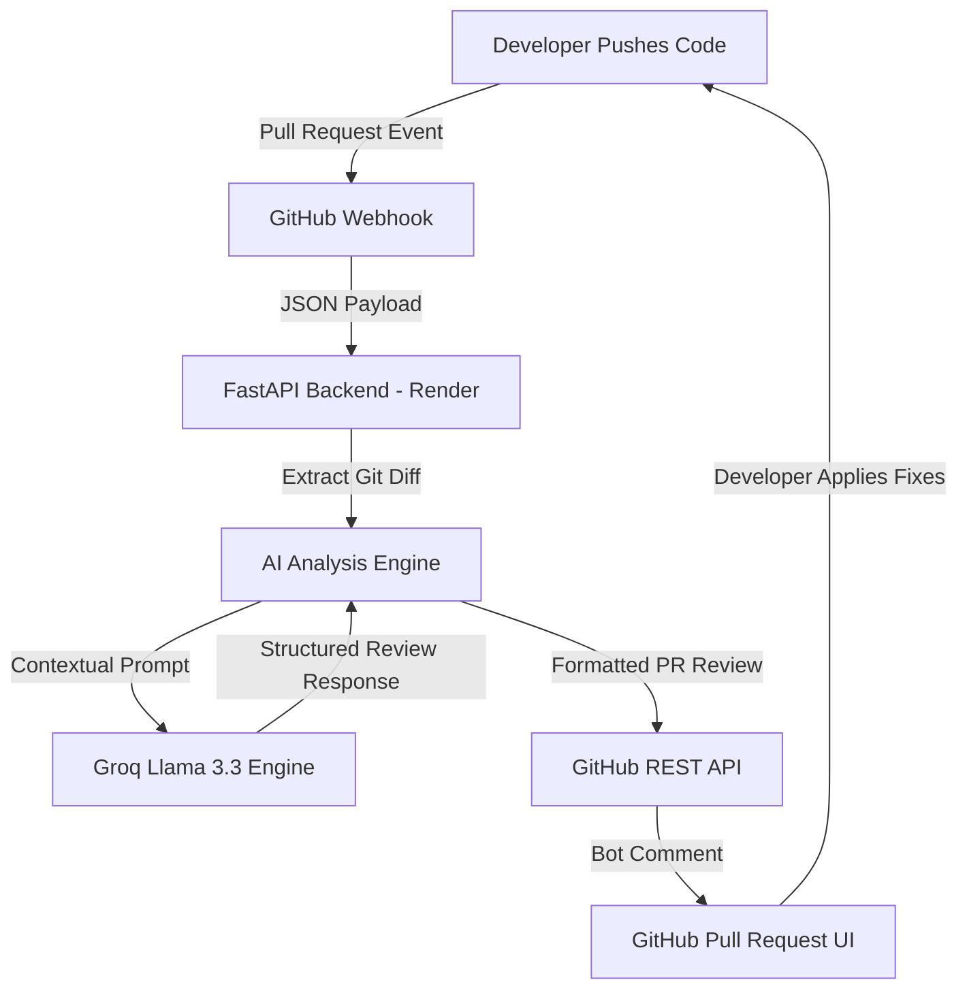

# ReviewPulse AI: Autonomous Code Review Agent

**Turning hours of manual code review into seconds of actionable AI insights.**

ReviewPulse AI is an intelligent engineering assistant that integrates directly into GitHub workflows. It listens for Pull Request events and performs an instant deep audit of code changes to identify bugs, security vulnerabilities, and performance bottlenecks before they reach production.

---

# Table of Contents

* Problem Statement
* Solution
* Architecture
* Tech Stack
* Workflow
* Features
* Future Scope
* Installation & Setup
* Author

---

# Problem Statement

Software engineering teams often face a major review bottleneck. Senior developers spend a significant portion of their time manually reviewing Pull Requests (PRs). Despite this effort:

* Critical logic bugs and code smells are frequently missed
* Security vulnerabilities such as hardcoded secrets and SQL injection risks can slip into production
* Review quality varies depending on reviewer expertise, focus, and workload
* Manual reviews slow down development velocity

---

# Solution

ReviewPulse AI acts as an AI-powered senior engineering assistant available 24/7. It provides:

* Instant automated Pull Request reviews
* Security-focused vulnerability detection
* Actionable code quality insights
* Line-by-line improvement suggestions
* Automated PR health scoring

The platform helps teams reduce review time, improve software quality, and catch issues earlier in the development lifecycle.

---

# Architecture

The platform follows an event-driven AI agent architecture deployed in the cloud.



---

# Tech Stack

| Component              | Technology                 |
| ---------------------- | -------------------------- |
| Backend Framework      | FastAPI (Python)           |
| AI Inference Engine    | Groq Cloud                 |
| LLM Model              | Llama-3.3-70b-versatile    |
| Cloud Hosting          | Render                     |
| API Integration        | GitHub REST API & Webhooks |
| Environment Management | Python-Dotenv              |

---

# Workflow

### 1. Trigger

A developer opens a new Pull Request or pushes updates to an existing PR.

### 2. Capture

GitHub sends a `pull_request` webhook payload to the FastAPI backend.

### 3. Analysis

The backend extracts the code diff and sends it to the Llama 3.3 model through Groq.

### 4. Audit

The AI agent analyzes the code for:

* Security vulnerabilities
* Logic issues
* Performance bottlenecks
* Code quality problems
* Best practice violations

### 5. Action

The generated review is formatted into structured Markdown and automatically posted back to the GitHub Pull Request.

---

# Features

## Real-Time PR Review

Provides automated feedback within seconds using Groq’s low-latency inference infrastructure.

## Security Detection

Identifies:

* Hardcoded credentials
* API key leaks
* SQL injection risks
* Unsafe coding patterns

## PR Health Score

Assigns a quality and risk score to every Pull Request.

## AI-Powered Suggestions

Generates actionable fixes and improvement recommendations.

## Cloud-Native Deployment

Runs entirely on Render and works continuously without requiring a local machine.

---

# Future Scope

## Multi-File Context Understanding

Integrate Retrieval-Augmented Generation (RAG) and vector databases to provide full codebase awareness.

## Custom Organization Rules

Allow teams to define custom coding standards using configurable rule files.

## IDE Integration

Develop a VS Code extension for pre-commit and pre-PR reviews.

## Automated AI Fixes

Enable one-click AI-generated commits for resolving detected issues automatically.

---

# Installation & Setup

## Clone Repository

```bash
git clone https://github.com/YourUsername/AI-Code-Reviewer.git
cd AI-Code-Reviewer
```

---

## Install Dependencies

```bash
pip install -r requirements.txt
```

---

## Configure Environment Variables

Create a `.env` file:

```env
GITHUB_TOKEN=your_github_pat
GROQ_API_KEY=your_groq_api_key
```

---

## Run Locally

```bash
python main.py
```

---

# Author

Harsh Jain
GitHub: `@Harsh-jain802`

Hackathon Project – 2026
